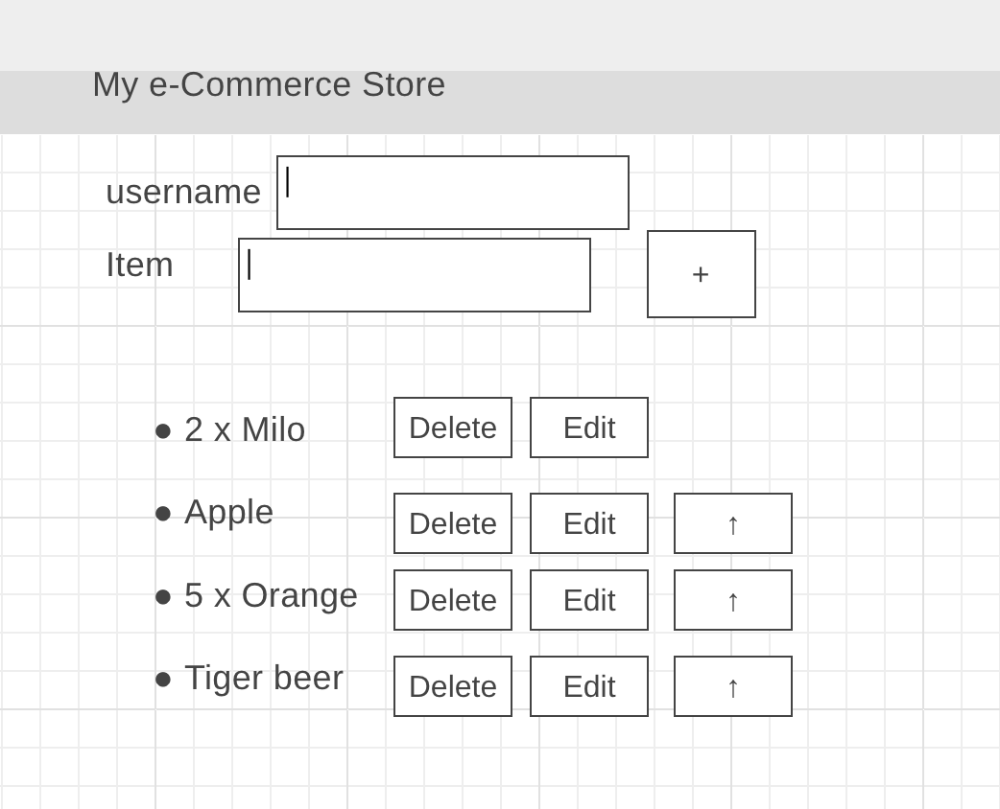

# shoppingcartapp

a springboot web application which extends sdf-workshop1 and sdf-workshop3.

### features

- home page: adding to cart will log in/create user's cart as well
    - typing in 'username' textbox loads/creates the user's cart automatically (mouseout)
        - href to path variable/query string -> getmapping
    - display cart after logging in/creating
- delete function
- sort up items
- edit individual items
